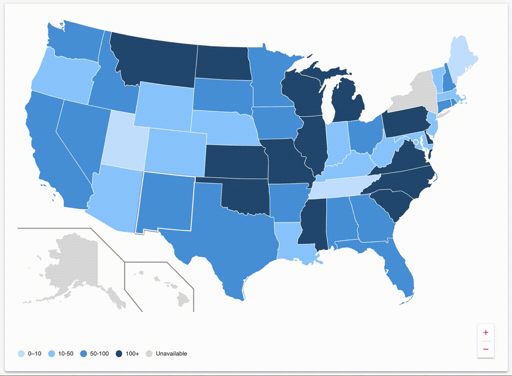

# Installation

## NPM

```
npm i --save react-usa-svg
```

## Yarn

```
yarn add react-usa-svg
```

# Usage

```ts
// TypeScript
import { USA, USAProps } from "react-usa-svg";

function MyConponent(props: USAProps) {
  return <USA {...props} />;
}
```

```ts
// JavaScript
import { USA } from "react-usa-svg";

function MyComponent(props) {
  return <USA {...props} />;
}
```

# Props and types

```ts
// Any US state abbreviature
type StatesAbbr = 'AL' | 'AK' | ... | "WY";

// Props passed directly to <USA /> component
type USAProps = {

  // Extra control on every US state SVG renderer
  HOC?: (props: {
    renderer: React.FC<{
        svg_props: React.SVGProps<SVGPathElement>;
    }>;
    svg_props?: SVGProps<SVGPathElement>;
    abbr: StatesAbbr;
  }) => JSX.Element;

  // Want to get <path /> element props based on specific state?
  getSVGProps?: (abbr: StatesAbbr) => SVGProps<SVGPathElement>;

  // SVG filter elements will be rendered inside main <svg> component
  SVGFilters?: Array<React.FC<React.SVGProps<SVGFilterElement>>>;

  // Props for additional frames
  framesStroke?: string;
  framesStrokeWidth?: string | number;
};
```

# Examples

## Full Storybook code of GIF from top can be found [HERE](./src/stories/USA.tsx).

Or take a look at similar simplified example below:

```ts
import { USA, USAProps } from "react-usa-svg";

function SVGMapComponent() {
  let [activeState, setActiveState] = React.useState(null);

  let props: USAProps = {
    SVGFilters: [
      () => (
        <filter id="filterDropShadow">
          <feDropShadow dx="0.2" dy="0.4" stdDeviation="1" />
        </filter>
      ),
    ],
    HOC: ({ renderer: Renderer, svg_props, abbr }) => {
      let svg_props_override = {
        onMouseEnter: () => {
          setActiveState(abbr);
        },
        onMouseLeave: () => {
          setActiveState(null);
        },
        fill: activeState === abbr ? `purple` : "green",
        stroke: activeState === abbr ? `white` : undefined,
        strokeWidth: activeState === abbr ? `2px` : undefined,
        filter: activeState === abbr ? "url(#filterDropShadow)" : undefined,
      };

      return (
        <Renderer
          svg_props={{
            ...svg_props,
            ...svg_props_override,
          }}
        />
      );
    },
  };

  return <USA {...props} />;
}
```
